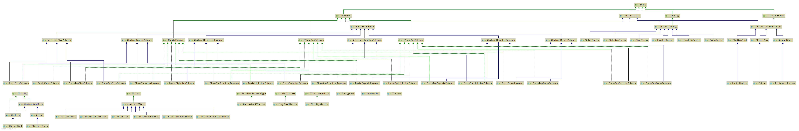

# CC3002 - Pokemon TCG: Elementos básicos

Tarea sobre la implementación del juego Pokemon TCG utilizando 
las metodologías aprendidas en el curso CC3002 - Metodologías de Diseño y Programación.

## Antes de empezar

Esta tarea fue realizada en su totalidad en el software IntelliJ IDEA, utilizando Java 1.8 SDK. 
Se incluye toda la la parte lógica solicitada. En la siguiente imagen se puede apreciar el 
diagrama UML que representa al desarrollo realizado.

## Descripción 

Para la realización de esta tarea, se utilizan principalmente patrones de diseño tales como Visitor, Double Dispatch y Observer. 
Esto permite generar un gran manejo de la Herencia y POO que nos facilita Java.

## Diseño

### Trainer 
Clase principal del proyecto, realiza gran parte de lo implementado, en ella se hacen llamados a distintos métodos que ejecutan diferentes 
tareas.

### ICard
Interfaz que describe el comportamiento de todas las cartas que participan en el juego, tales como:
 
 * Pokemon
 * Energias
 * Cartas de Entrenador
 
#### IPokemon

Interfaz que describe a todas las cartas de tipo Pokemon. Estos pueden ser de 3 fase, y cada uno de esas fases poseen 6 tipos, como:
* Básicos: Agua, Electrico, Fuego, Hierba, Psíquico y Lucha  
* Fase 1: Agua, Electrico, Fuego, Hierba, Psíquico y Lucha
* Fase 2: Agua, Electrico, Fuego, Hierba, Psíquico y Lucha

#### IEnergy
Al igual que los Pokemon, poseen 6 tipos distintos: Agua, Electrico, Fuego, Hierba, Psíquico y Lucha

#### ITrainerCard
Existen 3 tipos de cartas de entrenador:
* Soporte
* Estadio
* Objeto

### IAbility

Interfaz que describe el comportamiento de la habilidades que poseen las cartas de tipo **Pokemon**. 

#### Attack
Un tipo en particular de habilidad son los ataques, estos poseen un daño a diferencia de las habilidades en general.

### IVisitorCard, IVisitorAbility
Intefaz para utilizar el patrón de diseño Visitor tanto para jugar cartas como para efectuar habilidades.

## Test

El testing fue realizado con el framework **JUnit 4**. Se realiza un testing unitario para cada método, 
buscando minimizar posibles bugs que pueda poseer el proyecto.
Para ejecutar los test basta con verificar que el directorio `test`
se encuentre marcado como _Test Root_.

## Autor

* **Cristóbal Mesías** - [Github](https://github.com/cmesiasd)

## License

This project is licensed under the MIT License.

